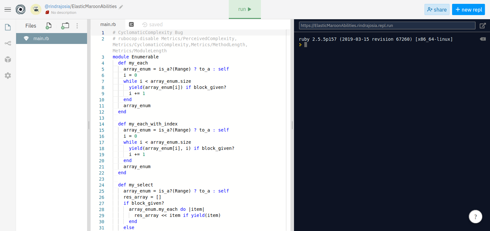

# ENUMERABLE
Enumerable Methods

In this project, you have implemented my own version of Ruby’s enumerable methods.
There are two (02) files in this project:
enumerable.rb : list of my enumerable methods.
test.rb: file test for enumerable methods

The goal here is to prove that there's no magic with Ruby’s enumerable methods.

# Built With
* Ruby

# Live Demo
**[Live Demo](https://repl.it/@rindrajosia/ElasticMaroonAbilities)**

# Getting Started
To use it locally, you need to :
1. Fork the repository to your GitHub account.
2. Choose a local folder for the cloned files.
3. Clone the repository to your local machine.
3. Uncomment test.rb file.
4. In your terminal: navigate to test.rb.
5. type: ruby test.rb

# Authors

**Rindra Josia**

* Github: **[@rindrajosia](https://github.com/rindrajosia)**
* Twitter: **[@rindrajosia](https://twitter.com/josia_rindra)**
* Linkedin: **[linkedin](https://www.linkedin.com/in/rindra-josia-99b2111a2/)**

#  Contributing

Contributions, issues and feature requests are welcome!
Feel free to check the **[issues](https://github.com/rindrajosia/enumerable/issues)** page.

#  Show your support

  Give ⭐️ if you like this project!

# Acknowledgments

* The odin project
* Microverse
* Contributors
